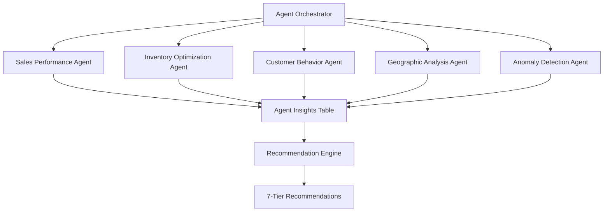
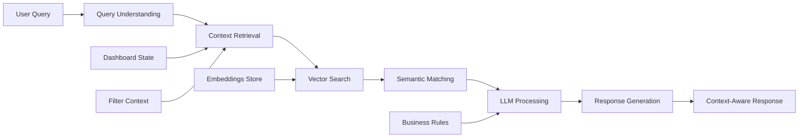
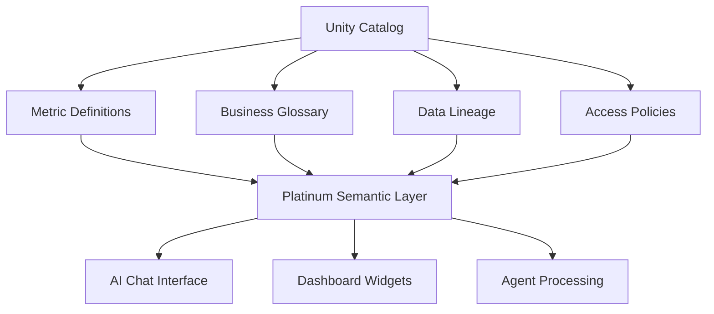

# Platinum Layer Architecture

The Platinum layer represents the AI/ML tier of our Supabase-centric lakehouse, providing autonomous analytics, intelligent recommendations, and natural language interfaces.

## 🏗️ Layer Overview

**Bronze → Silver → Gold → Platinum**

- **Bronze**: Raw data ingestion
- **Silver**: Clean, conformed data
- **Gold**: Business-ready marts and KPIs
- **Platinum**: AI/ML features, autonomous insights, and intelligent recommendations

## 🎯 7-Tier Recommendation System

### Recommendation Taxonomy

| Tier | Horizon | Primary Owner | Analytics Mode | Decision Authority | Example |
|------|---------|---------------|----------------|-------------------|---------|
| **Operational** | Hours - 7 days | Store/Ops Lead | Descriptive + Predictive | Store Manager | Replenish SKU-123 at Store-457; forecast OOS in 26h |
| **Tactical** | 2-12 weeks | Brand/Market Mgr | Diagnostic + Predictive | Brand Manager | Shift 20% spend to TikTok for Gen Z; run 2-week creator push |
| **Strategic** | 1-4 quarters | BU/Exec | Diagnostic + Prescriptive | Business Unit Head | Exit bottom 15% velocity SKUs in Region III |
| **Transformational** | 1-3 years | CTO/COO/CMO | Prescriptive + Feasibility | Executive Committee | Deploy edge brand-detection to 120 Pi nodes |
| **Governance** | Continuous | Compliance/Legal | Policy + Risk Models | Compliance Officer | Block Creative #849 - brand safety violation |
| **Financial** | 1-12 months | Finance/Pricing | Elasticity + Unit Economics | Pricing Committee | Increase price +3% on 1L variant; <0.8% volume loss |
| **Experimentation** | 2-10 weeks | Growth/Insights | Uplift + DoE + Bandits | Growth Team | Multi-arm bandit across 4 CTA variants |

### Analytics Modes

| Mode | Core Question | Typical Methods | Scout/CES Example |
|------|---------------|-----------------|-------------------|
| **Descriptive** | What happened? | Aggregations, BI dashboards, percent change | CES distribution by region; brand detections per week |
| **Diagnostic** | Why did it happen? | Variance decomposition, SHAP, attribution | Which promos/channels drove CES swings; why OOS spiked |
| **Predictive** | What will likely happen? | Time-series, ML models, classification | Next-week demand by SKU/store; creative underperformance probability |
| **Prescriptive** | What should we do? | Optimization, bandits/RL, scenario search | Optimal promo mix; next-best creative per persona |

## 🤖 Autonomous Analytics Agents

### Agent Architecture



### Agent Specifications

#### 1. Sales Performance Agent
- **Purpose**: Monitor sales trends, identify anomalies, track KPI performance
- **Triggers**: Daily sales variance >10%, weekly trends, KPI thresholds
- **Outputs**: Sales alerts, trend analysis, performance insights
- **Recommendations**: Operational (inventory) to Tactical (promotion adjustments)

#### 2. Inventory Optimization Agent
- **Purpose**: Predict stockouts, optimize replenishment, reduce waste
- **Triggers**: Stock level thresholds, demand forecast updates, supplier issues
- **Outputs**: Replenishment recommendations, stockout predictions, waste alerts
- **Recommendations**: Primarily Operational with Strategic portfolio insights

#### 3. Customer Behavior Agent
- **Purpose**: Analyze purchase patterns, segment customers, predict churn
- **Triggers**: Behavior changes, segment performance shifts, lifecycle events
- **Outputs**: Segmentation insights, churn predictions, behavior analysis
- **Recommendations**: Tactical (campaign targeting) to Strategic (customer strategy)

#### 4. Geographic Analysis Agent
- **Purpose**: Regional performance analysis, market expansion insights
- **Triggers**: Regional performance variance, competitive activity, expansion opportunities
- **Outputs**: Regional insights, expansion recommendations, competitive analysis
- **Recommendations**: Strategic (market entry) to Tactical (regional campaigns)

#### 5. Anomaly Detection Agent
- **Purpose**: Real-time anomaly detection across all metrics and dimensions
- **Triggers**: Statistical anomalies, pattern breaks, threshold violations
- **Outputs**: Anomaly alerts, root cause analysis, impact assessment
- **Recommendations**: Operational (immediate action) to Governance (policy updates)

## 💬 RAG Chat Interface

### Architecture Components



### Context Awareness

#### Dashboard State Integration
- Active filters (region, date range, product category)
- Current view (trends, geographic, product mix)
- User session and navigation history
- Previously asked questions in conversation

#### Semantic Understanding
- Business terminology and KPIs
- Hierarchical relationships (region → province → city)
- Product categorization and brand relationships
- Time-based context (seasonality, trends, cycles)

#### Multi-turn Conversations
- Conversation memory with context retention
- Follow-up question understanding
- Reference resolution ("show me more", "what about last month?")
- Context switching between topics

### Natural Language Capabilities

#### Sample Queries and Responses

**Query**: *"Show me underperforming stores in Mindanao"*
**Context Processing**: 
- Geographic filter: Mindanao region
- Performance metric: Below average sales/transactions
- Current dashboard state: Store performance view

**Response**: *"I found 12 underperforming stores in Mindanao (≥20% below regional average). Top concerns: Davao Store #445 (-35% vs target), CDO Store #234 (-28%). Key factors: competitor promotion activity, supply chain disruptions from recent typhoon. Would you like me to show the detailed breakdown or generate restocking recommendations?"*

**Query**: *"Why did sales drop last week?"*
**Context Processing**:
- Temporal context: Previous week analysis
- Anomaly detection: Sales variance analysis
- Multi-dimensional attribution: Channel, product, geographic

**Response**: *"Sales dropped 8.2% last week due to: (1) Luzon region -15% from typhoon disruptions affecting 23 stores, (2) Competitor Nestle promotion (-12% market share in beverages), (3) Alaska milk stockout in key NCR locations. Recovery signs: Visayas +3%, snacks category stable. Recommended actions: accelerate restocking, counter-promotion in affected categories."*

## 🔍 Vector Embeddings & Semantic Search

### Embedding Strategy

#### Content Types
- **Metric Definitions**: Business KPIs, formulas, descriptions
- **Business Rules**: Policies, calculations, logic
- **Historical Insights**: Previous recommendations, outcomes, learnings
- **Documentation**: System docs, process guides, troubleshooting

#### Vector Database Schema
```sql
CREATE TABLE platinum.embeddings (
  id UUID PRIMARY KEY,
  content TEXT NOT NULL,
  content_type TEXT NOT NULL, -- metric, rule, insight, doc
  source_table TEXT,          -- original data source
  source_id TEXT,             -- original record ID
  embedding VECTOR(1536),     -- OpenAI ada-002 dimensions
  metadata JSONB,             -- tags, categories, context
  tenant_id TEXT,             -- multi-tenant isolation
  created_at TIMESTAMPTZ
);

-- Vector similarity index
CREATE INDEX embeddings_vector_idx ON platinum.embeddings
USING ivfflat (embedding vector_cosine_ops) WITH (lists = 100);
```

### Search Capabilities

#### Semantic Query Processing
1. **Query Embedding**: Convert natural language to vector
2. **Similarity Search**: Find relevant content via cosine similarity
3. **Context Ranking**: Weight results by recency, relevance, authority
4. **Response Synthesis**: Combine multiple sources into coherent answer

#### Multi-modal Search
- **Text-to-Text**: Traditional semantic search
- **Data-to-Insights**: Find patterns in numeric data
- **Visual-to-Context**: Understand chart/graph context
- **Trend-to-Recommendation**: Pattern matching for suggestions

## 🏛️ Unity Catalog Integration

### Semantic Layer Architecture



### Semantic Definitions Table

```sql
CREATE TABLE platinum.semantic_definitions (
  id UUID PRIMARY KEY,
  metric_name TEXT UNIQUE NOT NULL,
  display_name TEXT NOT NULL,
  description TEXT,
  formula TEXT,                    -- SQL or business logic
  category TEXT,                   -- sales, inventory, customer, financial
  data_type TEXT DEFAULT 'numeric', -- numeric, percentage, currency, count
  unit TEXT,                       -- peso, percent, count, ratio
  tags TEXT[],                     -- searchable tags
  business_owner TEXT,             -- responsible stakeholder
  technical_owner TEXT,            -- data team contact
  source_tables TEXT[],            -- data lineage
  depends_on TEXT[],               -- metric dependencies
  refresh_frequency TEXT,          -- real-time, hourly, daily
  is_active BOOLEAN DEFAULT TRUE,
  tenant_id TEXT,
  created_at TIMESTAMPTZ DEFAULT NOW()
);
```

### Business Metrics Catalog

| Metric | Display Name | Description | Formula | Category | Unit |
|--------|--------------|-------------|---------|----------|------|
| `total_revenue` | Total Revenue | Sum of all transaction values | `SUM(peso_value)` | sales | peso |
| `avg_basket_size` | Avg Basket Size | Average items per transaction | `AVG(basket_size)` | sales | count |
| `oos_rate` | Out of Stock Rate | % time products unavailable | `OOS_hours/total_hours` | inventory | percent |
| `customer_ltv` | Customer LTV | Predicted lifetime value | `SUM(future_transactions)` | customer | peso |
| `ces_score` | Creative Effectiveness | AI-powered creative performance | `weighted_avg(engagement_metrics)` | marketing | score |

## 🔒 Security & Multi-tenancy

### Row Level Security (RLS)

All Platinum tables implement RLS with tenant isolation:

```sql
-- Recommendations policy
CREATE POLICY "recommendations_tenant_isolation" ON scout.recommendations
  FOR ALL USING (tenant_id = coalesce(auth.jwt()->>'tenant_id', 'default'));

-- Agent insights policy
CREATE POLICY "insights_tenant_isolation" ON platinum.agent_insights
  FOR ALL USING (tenant_id = coalesce(auth.jwt()->>'tenant_id', 'default'));

-- Chat conversations policy  
CREATE POLICY "chat_user_isolation" ON platinum.chat_conversations
  FOR ALL USING (user_id = auth.uid()::text);
```

### Access Control Matrix

| Role | Recommendations | Agent Insights | Chat | Embeddings | Semantic Definitions |
|------|----------------|----------------|------|------------|---------------------|
| **Anonymous** | Read (public only) | None | None | None | Read (public only) |
| **Authenticated** | Read (tenant) | Read (tenant) | Read (own) | Search only | Read (tenant) |
| **Manager** | Full (tenant) | Full (tenant) | Read (team) | Full (tenant) | Update (tenant) |
| **Admin** | Full (all) | Full (all) | Read (all) | Full (all) | Full (all) |

## 📊 Performance & Optimization

### Indexing Strategy

```sql
-- Recommendations
CREATE INDEX idx_recommendations_tier ON scout.recommendations(tier);
CREATE INDEX idx_recommendations_status ON scout.recommendations(status);
CREATE INDEX idx_recommendations_tenant ON scout.recommendations(tenant_id);
CREATE INDEX idx_recommendations_scope_gin ON scout.recommendations USING GIN (scope jsonb_path_ops);

-- Agent insights
CREATE INDEX idx_insights_agent_type ON platinum.agent_insights(agent_type);
CREATE INDEX idx_insights_severity ON platinum.agent_insights(severity);
CREATE INDEX idx_insights_expires_at ON platinum.agent_insights(expires_at);

-- Vector embeddings (specialized for similarity search)
CREATE INDEX idx_embeddings_vector ON platinum.embeddings
USING ivfflat (embedding vector_cosine_ops) WITH (lists = 100);
```

### Caching Strategy

#### Application Level
- SWR for dashboard data with 5-minute stale time
- Recommendation cache with 1-hour TTL
- Semantic search result cache (30 minutes)

#### Database Level
- Materialized views for heavy aggregations
- Connection pooling with PgBouncer
- Query plan caching for repeated patterns

#### Vector Search Optimization
- Pre-computed similarity clusters
- Hierarchical indexing for large datasets
- Batch embedding updates

## 🚀 Implementation Roadmap

### Phase 1: Foundation (Week 1-2)
- [x] Schema deployment via Bruno script
- [x] RLS policies and security
- [x] Basic recommendation CRUD
- [x] Seed data for all 7 tiers

### Phase 2: AI Integration (Week 3-4)
- [ ] OpenAI/Anthropic API integration
- [ ] Vector embedding pipeline
- [ ] Basic chat interface
- [ ] Semantic search functionality

### Phase 3: Agents (Week 5-6)
- [ ] Agent orchestrator framework
- [ ] Sales performance agent
- [ ] Inventory optimization agent
- [ ] Anomaly detection engine

### Phase 4: Advanced Features (Week 7-8)
- [ ] Multi-turn conversation memory
- [ ] Context-aware recommendations
- [ ] Advanced semantic search
- [ ] Dashboard integration

### Phase 5: Production Ready (Week 9-10)
- [ ] Performance optimization
- [ ] Multi-tenant testing
- [ ] Security audit
- [ ] Documentation completion

## 🔧 Configuration

### Environment Variables
```env
# AI/ML Configuration
OPENAI_API_KEY=sk-...
ANTHROPIC_API_KEY=sk-ant-...
EMBEDDING_MODEL=text-embedding-ada-002
CHAT_MODEL=gpt-4
MAX_CONTEXT_LENGTH=8192

# Vector Search
VECTOR_DIMENSION=1536
SIMILARITY_THRESHOLD=0.8
MAX_SEARCH_RESULTS=10

# Agent Configuration
AGENT_POLLING_INTERVAL=300
INSIGHT_RETENTION_DAYS=30
RECOMMENDATION_AUTO_ARCHIVE=90
```

### Tuning Parameters
```yaml
agents:
  sales_performance:
    anomaly_threshold: 0.15
    trend_lookback_days: 30
    alert_severity_threshold: 0.7
    
  inventory_optimization:
    stockout_prediction_horizon: 7
    reorder_point_safety_factor: 1.2
    demand_forecast_confidence: 0.8

chat_interface:
  max_conversation_length: 50
  context_window_messages: 10
  response_timeout_seconds: 30
  
vector_search:
  embedding_refresh_hours: 24
  similarity_cutoff: 0.75
  max_results_per_query: 15
```

This Platinum layer transforms Scout Dashboard from a traditional BI tool into an intelligent, autonomous analytics platform that proactively generates insights and recommendations across all business tiers.