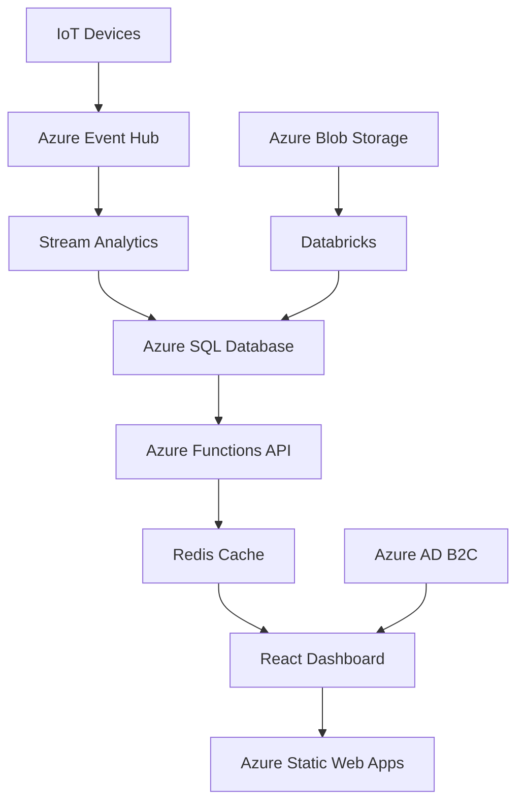

# Retail Analytics Dashboard - GitHub Repository Structure

```
retail-analytics-dashboard/
├── .github/
│   ├── workflows/
│   │   ├── ci.yml
│   │   ├── cd-staging.yml
│   │   ├── cd-production.yml
│   │   ├── codeql-analysis.yml
│   │   └── dependency-review.yml
│   ├── ISSUE_TEMPLATE/
│   │   ├── bug_report.md
│   │   ├── feature_request.md
│   │   └── config.yml
│   ├── PULL_REQUEST_TEMPLATE.md
│   ├── CODEOWNERS
│   ├── dependabot.yml
│   └── FUNDING.yml
├── docs/
│   ├── architecture/
│   │   ├── system-design.md
│   │   ├── data-flow.md
│   │   ├── api-design.md
│   │   └── security.md
│   ├── deployment/
│   │   ├── azure-setup.md
│   │   ├── environment-variables.md
│   │   └── troubleshooting.md
│   ├── development/
│   │   ├── getting-started.md
│   │   ├── coding-standards.md
│   │   └── testing-guide.md
│   └── api/
│       └── swagger.json
├── frontend/
│   ├── src/
│   │   ├── components/
│   │   ├── hooks/
│   │   ├── store/
│   │   ├── services/
│   │   ├── utils/
│   │   └── types/
│   ├── public/
│   ├── tests/
│   ├── package.json
│   ├── tsconfig.json
│   ├── vite.config.ts
│   └── README.md
├── backend/
│   ├── functions/
│   │   ├── GetMetrics/
│   │   ├── GetBrands/
│   │   └── shared/
│   ├── tests/
│   ├── package.json
│   ├── tsconfig.json
│   └── README.md
├── infrastructure/
│   ├── terraform/
│   │   ├── main.tf
│   │   ├── variables.tf
│   │   ├── outputs.tf
│   │   └── modules/
│   ├── arm-templates/
│   └── scripts/
├── databricks/
│   ├── notebooks/
│   ├── jobs/
│   ├── libraries/
│   └── configs/
├── database/
│   ├── migrations/
│   ├── seeds/
│   ├── stored-procedures/
│   └── indexes/
├── tests/
│   ├── e2e/
│   ├── integration/
│   ├── load/
│   └── security/
├── scripts/
│   ├── setup.sh
│   ├── deploy.sh
│   └── clean.sh
├── .env.example
├── .gitignore
├── .editorconfig
├── .eslintrc.json
├── .prettierrc
├── docker-compose.yml
├── Dockerfile
├── README.md
├── CONTRIBUTING.md
├── CODE_OF_CONDUCT.md
├── SECURITY.md
├── LICENSE
└── CHANGELOG.md
```

---

# README.md

```markdown
# 🛍️ Retail Analytics Dashboard

[](https://github.com/yourorg/retail-analytics-dashboard/actions)
[](https://codecov.io/gh/yourorg/retail-analytics-dashboard)
[](https://opensource.org/licenses/MIT)
[](https://github.com/yourorg/retail-analytics-dashboard/actions/workflows/azure-static-web-apps.yml)

A modern, Power BI-style React dashboard for visualizing retail transaction data from sari-sari stores, providing real-time insights into consumer behavior, product performance, and AI-driven recommendations.

## 🚀 Features

- **Real-time Analytics**: Live transaction monitoring with sub-minute latency
- **AI-Powered Insights**: Machine learning models for product recommendations and demand forecasting
- **Brand Performance Tracking**: Comprehensive brand analytics with confidence scoring
- **Customer Journey Mapping**: Track customer interactions across sessions using facial recognition
- **Sentiment Analysis**: Real-time analysis of customer conversations
- **Mobile Responsive**: Optimized for tablets and mobile devices
- **Export Capabilities**: Generate reports in PDF, Excel, and PowerPoint formats

## 📋 Table of Contents

- [Architecture](#architecture)
- [Prerequisites](#prerequisites)
- [Quick Start](#quick-start)
- [Development](#development)
- [Testing](#testing)
- [Deployment](#deployment)
- [API Documentation](#api-documentation)
- [Contributing](#contributing)
- [Troubleshooting](#troubleshooting)
- [License](#license)

## 🏗️ Architecture



### Tech Stack

- **Frontend**: React 18, TypeScript, Material-UI, Recharts, D3.js
- **Backend**: Azure Functions, Node.js, TypeScript
- **Database**: Azure SQL Database
- **ETL**: Azure Databricks, Delta Lake
- **Caching**: Redis
- **Authentication**: Azure AD B2C
- **Hosting**: Azure Static Web Apps
- **Monitoring**: Azure Application Insights

## 📚 Prerequisites

- Node.js >= 18.0.0
- npm >= 8.0.0 or yarn >= 1.22.0
- Azure CLI >= 2.50.0
- Terraform >= 1.5.0 (for infrastructure)
- Git
- Visual Studio Code (recommended)

### Azure Resources Required

- Azure Subscription
- Azure SQL Database
- Azure Functions Premium Plan
- Azure Static Web Apps
- Azure Databricks Workspace
- Redis Cache
- Application Insights

## 🚀 Quick Start

### 1. Clone the Repository

```bash
git clone https://github.com/yourorg/retail-analytics-dashboard.git
cd retail-analytics-dashboard
```

### 2. Install Dependencies

```bash
# Install root dependencies
npm install

# Install frontend dependencies
cd frontend && npm install

# Install backend dependencies
cd ../backend && npm install
```

### 3. Configure Environment Variables

```bash
# Copy example environment file
cp .env.example .env

# Edit .env with your Azure credentials
# See docs/deployment/environment-variables.md for details
```

### 4. Set Up Database

```bash
# Run database migrations
npm run db:migrate

# Seed sample data (development only)
npm run db:seed
```

### 5. Start Development Servers

```bash
# Start all services
npm run dev

# Or start individually:
# Frontend: http://localhost:5173
cd frontend && npm run dev

# Backend: http://localhost:7071
cd backend && npm run start
```

## 💻 Development

### Project Structure

- `/frontend` - React application
- `/backend` - Azure Functions API
- `/databricks` - ETL notebooks and jobs
- `/database` - SQL scripts and migrations
- `/infrastructure` - Terraform and ARM templates
- `/docs` - Comprehensive documentation

### Development Workflow

1. Create a feature branch: `git checkout -b feature/your-feature`
2. Make changes and test locally
3. Run linting: `npm run lint`
4. Run tests: `npm run test`
5. Submit a pull request

### Code Style

We use ESLint and Prettier for code formatting. Run `npm run format` to auto-format code.

See [CONTRIBUTING.md](CONTRIBUTING.md) for detailed guidelines.

## 🧪 Testing

```bash
# Run all tests
npm run test

# Run specific test suites
npm run test:unit        # Unit tests
npm run test:integration # Integration tests
npm run test:e2e        # End-to-end tests

# Run with coverage
npm run test:coverage

# Load testing
npm run test:load
```

## 🚢 Deployment

### Staging Deployment

```bash
# Deploy to staging
npm run deploy:staging

# Or use GitHub Actions (automatic on develop branch)
```

### Production Deployment

```bash
# Deploy to production
npm run deploy:production

# Or merge to main branch for automatic deployment
```

See [docs/deployment/](docs/deployment/) for detailed deployment guides.

## 📖 API Documentation

API documentation is available at:
- Swagger UI: https://api.your-domain.com/swagger
- OpenAPI Spec: [docs/api/swagger.json](docs/api/swagger.json)

### Key Endpoints

- `GET /api/metrics/summary` - Dashboard summary metrics
- `GET /api/interactions/timeseries` - Time series data
- `GET /api/brands/performance` - Brand analytics
- `GET /api/stores/{storeId}/metrics` - Store-specific metrics

## 🤝 Contributing

We welcome contributions! Please see [CONTRIBUTING.md](CONTRIBUTING.md) for guidelines.

### Development Setup

1. Fork the repository
2. Create your feature branch
3. Follow coding standards
4. Write tests for new features
5. Submit a pull request

## 🐛 Troubleshooting

See [Build & CI Troubleshooting Guide](#build--ci-troubleshooting-guide) below.

Common issues:
- [Database connection issues](docs/deployment/troubleshooting.md#database)
- [Authentication problems](docs/deployment/troubleshooting.md#auth)
- [Build failures](docs/deployment/troubleshooting.md#build)

## 📄 License

This project is licensed under the MIT License - see [LICENSE](LICENSE) for details.

## 🙏 Acknowledgments

- Retail data collection framework by [Your Organization]
- Icons by [Lucide](https://lucide.dev/)
- Charts powered by [Recharts](https://recharts.org/)

---

**Questions?** Open an [issue](https://github.com/yourorg/retail-analytics-dashboard/issues) or contact the team at retail-analytics@yourorg.com
```

---

# CONTRIBUTING.md

```markdown
# Contributing to Retail Analytics Dashboard

Thank you for your interest in contributing! This document provides guidelines and instructions for contributing.

## 📋 Table of Contents

- [Code of Conduct](#code-of-conduct)
- [Getting Started](#getting-started)
- [Development Process](#development-process)
- [Pull Request Process](#pull-request-process)
- [Coding Standards](#coding-standards)
- [Testing Guidelines](#testing-guidelines)
- [Documentation](#documentation)
- [Community](#community)

## 📜 Code of Conduct

Please read and follow our [Code of Conduct](CODE_OF_CONDUCT.md).

## 🚀 Getting Started

### Prerequisites

1. Fork the repository
2. Clone your fork:
   ```bash
   git clone https://github.com/YOUR_USERNAME/retail-analytics-dashboard.git
   cd retail-analytics-dashboard
   ```
3. Add upstream remote:
   ```bash
   git remote add upstream https://github.com/yourorg/retail-analytics-dashboard.git
   ```
4. Install dependencies:
   ```bash
   npm install
   ```

### Environment Setup

1. Copy `.env.example` to `.env`
2. Configure required environment variables
3. Set up pre-commit hooks:
   ```bash
   npm run prepare
   ```

## 💻 Development Process

### 1. Create a Feature Branch

```bash
# Sync with upstream
git fetch upstream
git checkout main
git merge upstream/main

# Create feature branch
git checkout -b feature/your-feature-name
```

### 2. Naming Conventions

#### Branch Names
- Features: `feature/description`
- Bugs: `fix/description`
- Docs: `docs/description`
- Refactor: `refactor/description`
- Tests: `test/description`

#### Commit Messages

Follow [Conventional Commits](https://www.conventionalcommits.org/):

```
type(scope): subject

body

footer
```

Types:
- `feat`: New feature
- `fix`: Bug fix
- `docs`: Documentation
- `style`: Code style (formatting, semicolons, etc)
- `refactor`: Code refactoring
- `test`: Add/update tests
- `chore`: Maintenance tasks
- `perf`: Performance improvements

Examples:
```bash
feat(dashboard): add real-time transaction monitoring
fix(api): resolve timeout issue in brand analytics endpoint
docs(readme): update deployment instructions
```

### 3. Code Style

#### TypeScript/JavaScript

```typescript
// Use explicit types
interface UserData {
  id: string;
  name: string;
  age: number;
}

// Prefer const over let
const processData = (data: UserData[]): ProcessedData => {
  // Use meaningful variable names
  const validUsers = data.filter(user => user.age >= 18);
  
  // Add comments for complex logic
  // Calculate weighted score based on transaction history
  return validUsers.map(user => ({
    ...user,
    score: calculateUserScore(user)
  }));
};

// Use async/await over promises
const fetchData = async (endpoint: string): Promise<ApiResponse> => {
  try {
    const response = await fetch(endpoint);
    return await response.json();
  } catch (error) {
    logger.error('Failed to fetch data', { endpoint, error });
    throw new ApiError('Data fetch failed', error);
  }
};
```

#### React Components

```typescript
// Use functional components with TypeScript
interface DashboardProps {
  userId: string;
  onRefresh: () => void;
}

export const Dashboard: React.FC<DashboardProps> = ({ userId, onRefresh }) => {
  // Use custom hooks for logic
  const { data, loading, error } = useUserData(userId);
  
  // Early returns for edge cases
  if (loading) return <LoadingSpinner />;
  if (error) return <ErrorDisplay error={error} />;
  
  return (
    <DashboardLayout>
      {/* Component content */}
    </DashboardLayout>
  );
};
```

#### SQL Queries

```sql
-- Use clear table aliases
-- Add comments for complex queries
WITH DailyMetrics AS (
  -- Calculate daily transaction metrics
  SELECT 
    si.StoreID,
    CAST(si.TransactionDate AS DATE) as TransactionDay,
    COUNT(DISTINCT si.InteractionID) as TransactionCount,
    COUNT(DISTINCT si.FacialID) as UniqueCustomers
  FROM SalesInteractions si
  WHERE si.TransactionDate >= DATEADD(day, -30, GETDATE())
  GROUP BY si.StoreID, CAST(si.TransactionDate AS DATE)
)
SELECT * FROM DailyMetrics
ORDER BY TransactionDay DESC, TransactionCount DESC;
```

### 4. Testing Requirements

#### Unit Tests
- Minimum 80% code coverage
- Test edge cases and error scenarios
- Use descriptive test names

```typescript
describe('BrandAnalytics', () => {
  describe('calculateBrandPerformance', () => {
    it('should return correct metrics for valid brand data', () => {
      const brandData = mockBrandData();
      const result = calculateBrandPerformance(brandData);
      
      expect(result.totalTransactions).toBe(150);
      expect(result.avgConfidence).toBeCloseTo(0.85, 2);
    });
    
    it('should handle empty data gracefully', () => {
      const result = calculateBrandPerformance([]);
      
      expect(result.totalTransactions).toBe(0);
      expect(result.avgConfidence).toBe(0);
    });
  });
});
```

#### Integration Tests
```typescript
describe('API Integration', () => {
  it('should fetch and process transaction data', async () => {
    const response = await request(app)
      .get('/api/transactions')
      .query({ startDate: '2024-01-01', endDate: '2024-01-31' })
      .expect(200);
    
    expect(response.body).toHaveProperty('data');
    expect(response.body.data).toBeInstanceOf(Array);
    expect(response.body.data[0]).toHaveProperty('interactionId');
  });
});
```

## 🔄 Pull Request Process

### 1. Before Submitting

- [ ] Update your branch with latest main
- [ ] Run linting: `npm run lint`
- [ ] Run tests: `npm run test`
- [ ] Update documentation if needed
- [ ] Add tests for new features
- [ ] Check bundle size impact: `npm run build:analyze`

### 2. PR Template

```markdown
## Description
Brief description of changes

## Type of Change
- [ ] Bug fix (non-breaking change)
- [ ] New feature (non-breaking change)
- [ ] Breaking change
- [ ] Documentation update

## Testing
- [ ] Unit tests pass
- [ ] Integration tests pass
- [ ] Manual testing completed

## Checklist
- [ ] Code follows project style guidelines
- [ ] Self-review completed
- [ ] Comments added for complex code
- [ ] Documentation updated
- [ ] No console.logs or debugging code

## Screenshots (if applicable)
Add screenshots for UI changes

## Related Issues
Closes #123
```

### 3. Review Process

1. Automated checks must pass
2. Code review by at least one maintainer
3. Address review feedback
4. Maintainer merges PR

## 📚 Documentation

### Code Documentation

```typescript
/**
 * Calculates brand performance metrics for a given time period
 * @param brandId - Unique identifier for the brand
 * @param startDate - Start of the analysis period
 * @param endDate - End of the analysis period
 * @returns BrandMetrics object containing performance data
 * @throws {InvalidDateRangeError} If date range is invalid
 * @example
 * const metrics = await calculateBrandMetrics('BRAND001', '2024-01-01', '2024-01-31');
 */
export async function calculateBrandMetrics(
  brandId: string,
  startDate: string,
  endDate: string
): Promise<BrandMetrics> {
  // Implementation
}
```

### API Documentation

Use JSDoc comments for API endpoints:

```typescript
/**
 * @api {get} /api/brands/:id Get Brand Performance
 * @apiName GetBrandPerformance
 * @apiGroup Brands
 * @apiVersion 1.0.0
 * 
 * @apiParam {String} id Brand unique ID
 * @apiQuery {String} [startDate] Start date (YYYY-MM-DD)
 * @apiQuery {String} [endDate] End date (YYYY-MM-DD)
 * 
 * @apiSuccess {Object} data Brand performance data
 * @apiSuccess {String} data.brandId Brand ID
 * @apiSuccess {Number} data.totalTransactions Total transactions
 * @apiSuccess {Number} data.avgConfidence Average confidence score
 * 
 * @apiError {Object} 404 Brand not found
 * @apiError {Object} 400 Invalid date range
 */
```

## 🤝 Community

### Getting Help

- 💬 [Discussions](https://github.com/yourorg/retail-analytics-dashboard/discussions)
- 🐛 [Issue Tracker](https://github.com/yourorg/retail-analytics-dashboard/issues)
- 📧 Email: retail-analytics@yourorg.com

### Communication Channels

- Weekly dev meetings (Thursdays 2 PM UTC)
- Slack: #retail-analytics-dev
- Technical decisions documented in [ADRs](docs/architecture/decisions/)

## 🙏 Recognition

Contributors are recognized in:
- [CONTRIBUTORS.md](CONTRIBUTORS.md)
- Release notes
- Project README

Thank you for contributing! 🎉
```

---

# Build & CI Troubleshooting Guide

```markdown
# 🔧 Build & CI Troubleshooting Guide

This guide helps resolve common build and CI/CD issues.

## 📋 Table of Contents

- [Local Build Issues](#local-build-issues)
- [CI Pipeline Failures](#ci-pipeline-failures)
- [Deployment Issues](#deployment-issues)
- [Environment-Specific Problems](#environment-specific-problems)
- [Performance Issues](#performance-issues)
- [Debugging Tools](#debugging-tools)

## 🏗️ Local Build Issues

### Node Version Mismatch

**Problem**: `Error: The engine "node" is incompatible with this module`

**Solution**:
```bash
# Check current version
node --version

# Use nvm to switch to correct version
nvm use 18
# Or install if not available
nvm install 18.17.0
nvm use 18.17.0
```

### Dependencies Installation Failures

**Problem**: `npm install` fails with permission errors

**Solution**:
```bash
# Clear npm cache
npm cache clean --force

# Remove node_modules and package-lock
rm -rf node_modules package-lock.json

# Reinstall
npm install

# If permission issues persist on Mac/Linux
sudo npm install --unsafe-perm
```

### TypeScript Compilation Errors

**Problem**: `Cannot find module` or type errors

**Solution**:
```bash
# Rebuild TypeScript project references
npm run clean
npm run build:types

# Check tsconfig.json paths
# Ensure all path mappings are correct in tsconfig.json
```

### Memory Issues During Build

**Problem**: `JavaScript heap out of memory`

**Solution**:
```bash
# Increase Node memory limit
export NODE_OPTIONS="--max-old-space-size=4096"
npm run build

# Or add to package.json scripts
"build": "NODE_OPTIONS='--max-old-space-size=4096' vite build"
```

## 🔄 CI Pipeline Failures

### GitHub Actions Failures

#### Test Failures in CI but Not Locally

**Problem**: Tests pass locally but fail in CI

**Common Causes & Solutions**:

1. **Timezone differences**:
   ```typescript
   // Use UTC in tests
   const testDate = new Date('2024-01-01T00:00:00.000Z');
   ```

2. **Environment variables**:
   ```yaml
   # In .github/workflows/ci.yml
   env:
     TZ: 'UTC'
     NODE_ENV: 'test'
     DATABASE_URL: ${{ secrets.TEST_DATABASE_URL }}
   ```

3. **Dependency versions**:
   ```json
   // Use exact versions in package.json
   "dependencies": {
     "react": "18.2.0", // not ^18.2.0
   }
   ```

#### Azure SQL Connection Failures

**Problem**: `Login failed for user` in CI

**Solution**:
```yaml
# Check GitHub secrets
# Ensure connection string is properly formatted
- name: Test Database Connection
  env:
    DATABASE_URL: ${{ secrets.DATABASE_URL }}
  run: |
    # Add connection test
    npm run db:test-connection
```

#### Build Timeout

**Problem**: Build exceeds time limit

**Solution**:
```yaml
# Increase timeout in workflow
jobs:
  build:
    timeout-minutes: 30  # Increase from default 6 hours
    
# Add caching
- uses: actions/cache@v3
  with:
    path: ~/.npm
    key: ${{ runner.os }}-node-${{ hashFiles('**/package-lock.json') }}
```

### Azure DevOps Pipeline Issues

#### Artifact Publishing Failures

**Problem**: `##[error]Publishing build artifacts failed`

**Solution**:
```yaml
# Check artifact paths
- task: PublishBuildArtifacts@1
  inputs:
    PathtoPublish: '$(Build.ArtifactStagingDirectory)'
    ArtifactName: 'drop'
    # Ensure path exists
    condition: succeededOrFailed()
```

#### Service Connection Issues

**Problem**: `Could not find service connection`

**Solution**:
1. Verify service connection in Project Settings
2. Check permissions for build service account
3. Regenerate service principal credentials if expired

## 🚢 Deployment Issues

### Azure Static Web Apps

#### Deployment Validation Failed

**Problem**: `Deployment validation failed`

**Solution**:
```bash
# Check staticwebapp.config.json
{
  "routes": [
    {
      "route": "/api/*",
      "allowedRoles": ["authenticated"]
    }
  ],
  "navigationFallback": {
    "rewrite": "/index.html"
  }
}

# Verify build output
ls -la dist/  # Should contain index.html
```

#### API Routes Not Working

**Problem**: 404 errors for API routes

**Solution**:
```javascript
// Check API function structure
// api/GetMetrics/index.js should export:
module.exports = async function (context, req) {
  // Function implementation
};

// Or for TypeScript:
const httpTrigger: AzureFunction = async function() {};
export default httpTrigger;
```

### Database Migration Failures

#### Migration Lock

**Problem**: `Migration already in progress`

**Solution**:
```sql
-- Check for lock
SELECT * FROM __MigrationHistory WHERE IsLocked = 1;

-- Release lock if stuck
UPDATE __MigrationHistory SET IsLocked = 0 WHERE IsLocked = 1;
```

#### Schema Conflicts

**Problem**: `Column already exists` or similar

**Solution**:
```bash
# Generate migration status
npm run migration:status

# Rollback if needed
npm run migration:rollback

# Re-run migrations
npm run migration:up
```

## 🌍 Environment-Specific Problems

### Development vs Production Differences

#### API URL Misconfigurations

**Problem**: API calls fail in production

**Solution**:
```typescript
// Use environment-specific configs
const API_URL = process.env.REACT_APP_API_URL || 'http://localhost:7071';

// In .env.production
REACT_APP_API_URL=https://api.yourdomain.com
```

#### CORS Issues

**Problem**: `Access blocked by CORS policy`

**Solution**:
```typescript
// In Azure Functions
context.res = {
  headers: {
    'Access-Control-Allow-Origin': process.env.ALLOWED_ORIGINS,
    'Access-Control-Allow-Methods': 'GET, POST, PUT, DELETE, OPTIONS',
    'Access-Control-Allow-Headers': 'Content-Type, Authorization'
  }
};
```

### Redis Connection Issues

**Problem**: `Redis connection timeout`

**Solution**:
```typescript
// Add retry logic
const redisClient = createClient({
  url: process.env.REDIS_URL,
  socket: {
    connectTimeout: 5000,
    reconnectStrategy: (retries) => {
      if (retries > 10) return false;
      return Math.min(retries * 100, 3000);
    }
  }
});
```

## ⚡ Performance Issues

### Slow Build Times

**Solutions**:
1. **Use build caching**:
   ```json
   // vite.config.ts
   {
     "build": {
       "cache": true,
       "incremental": true
     }
   }
   ```

2. **Parallelize tasks**:
   ```json
   "scripts": {
     "build:all": "concurrently \"npm:build:frontend\" \"npm:build:backend\""
   }
   ```

3. **Optimize imports**:
   ```typescript
   // Instead of
   import { Button } from '@mui/material';
   // Use
   import Button from '@mui/material/Button';
   ```

### Memory Leaks in Development

**Problem**: Dev server becomes slow over time

**Solution**:
```typescript
// Clean up effects properly
useEffect(() => {
  const subscription = dataService.subscribe();
  return () => subscription.unsubscribe();
}, []);

// Use React DevTools Profiler to identify issues
```

## 🛠️ Debugging Tools

### Useful Commands

```bash
# Debug Node process
node --inspect npm run dev

# Check for dependency issues
npm ls
npm audit

# Analyze bundle size
npm run build -- --analyze

# Database connection test
npm run db:test

# View environment variables (safely)
npm run env:check
```

### VS Code Debug Configuration

```json
// .vscode/launch.json
{
  "version": "0.2.0",
  "configurations": [
    {
      "type": "node",
      "request": "launch",
      "name": "Debug Backend",
      "program": "${workspaceFolder}/backend/src/index.ts",
      "runtimeArgs": ["--inspect=9229"],
      "env": {
        "NODE_ENV": "development"
      }
    },
    {
      "type": "chrome",
      "request": "launch",
      "name": "Debug Frontend",
      "url": "http://localhost:5173",
      "webRoot": "${workspaceFolder}/frontend/src"
    }
  ]
}
```

### Logging Best Practices

```typescript
// Use structured logging
import { logger } from './utils/logger';

logger.info('Processing transaction', {
  transactionId: id,
  storeId: store,
  timestamp: new Date().toISOString()
});

// Add correlation IDs for tracing
context.traceContext = {
  operationId: context.invocationId,
  parentId: req.headers['x-correlation-id']
};
```

## 📞 Getting Help

If these solutions don't resolve your issue:

1. Check [existing issues](https://github.com/yourorg/retail-analytics-dashboard/issues)
2. Search [discussions](https://github.com/yourorg/retail-analytics-dashboard/discussions)
3. Create a new issue with:
   - Error messages
   - Steps to reproduce
   - Environment details
   - Relevant logs

## 🔗 Additional Resources

- [Azure Static Web Apps Docs](https://docs.microsoft.com/azure/static-web-apps/)
- [GitHub Actions Debugging](https://docs.github.com/actions/monitoring-and-troubleshooting-workflows)
- [Vite Troubleshooting](https://vitejs.dev/guide/troubleshooting.html)
- [TypeScript Handbook](https://www.typescriptlang.org/docs/)
```

---

# Additional Essential Files

## .github/workflows/ci.yml

```yaml
name: CI

on:
  push:
    branches: [ main, develop ]
  pull_request:
    branches: [ main ]

jobs:
  lint:
    runs-on: ubuntu-latest
    steps:
      - uses: actions/checkout@v3
      - uses: actions/setup-node@v3
        with:
          node-version: '18'
          cache: 'npm'
      - run: npm ci
      - run: npm run lint

  test:
    runs-on: ubuntu-latest
    services:
      redis:
        image: redis:7-alpine
        options: >-
          --health-cmd "redis-cli ping"
          --health-interval 10s
          --health-timeout 5s
          --health-retries 5
        ports:
          - 6379:6379
    
    steps:
      - uses: actions/checkout@v3
      - uses: actions/setup-node@v3
        with:
          node-version: '18'
          cache: 'npm'
      
      - name: Install dependencies
        run: npm ci
      
      - name: Run unit tests
        run: npm run test:unit
        env:
          NODE_ENV: test
          REDIS_URL: redis://localhost:6379
      
      - name: Run integration tests
        run: npm run test:integration
        env:
          DATABASE_URL: ${{ secrets.TEST_DATABASE_URL }}
      
      - name: Upload coverage
        uses: codecov/codecov-action@v3
        with:
          token: ${{ secrets.CODECOV_TOKEN }}
          files: ./coverage/lcov.info

  build:
    runs-on: ubuntu-latest
    steps:
      - uses: actions/checkout@v3
      - uses: actions/setup-node@v3
        with:
          node-version: '18'
          cache: 'npm'
      
      - name: Install dependencies
        run: npm ci
      
      - name: Build frontend
        run: npm run build:frontend
        env:
          REACT_APP_API_URL: ${{ secrets.STAGING_API_URL }}
      
      - name: Build backend
        run: npm run build:backend
      
      - name: Upload artifacts
        uses: actions/upload-artifact@v3
        with:
          name: build-artifacts
          path: |
            frontend/dist
            backend/dist

  security:
    runs-on: ubuntu-latest
    steps:
      - uses: actions/checkout@v3
      - name: Run security audit
        run: npm audit --audit-level=moderate
      
      - name: Run Snyk
        uses: snyk/actions/node@master
        env:
          SNYK_TOKEN: ${{ secrets.SNYK_TOKEN }}
```

## .github/CODEOWNERS

```
# Global owners
* @yourorg/retail-analytics-leads

# Frontend
/frontend/ @yourorg/frontend-team
*.tsx @yourorg/frontend-team
*.css @yourorg/frontend-team

# Backend
/backend/ @yourorg/backend-team
/database/ @yourorg/backend-team

# Infrastructure
/infrastructure/ @yourorg/devops-team
/.github/ @yourorg/devops-team

# Documentation
/docs/ @yourorg/tech-writers
*.md @yourorg/tech-writers

# Security
/security/ @yourorg/security-team
SECURITY.md @yourorg/security-team
```

## package.json (root)

```json
{
  "name": "retail-analytics-dashboard",
  "version": "1.0.0",
  "description": "Modern retail analytics dashboard for sari-sari stores",
  "private": true,
  "workspaces": [
    "frontend",
    "backend"
  ],
  "scripts": {
    "dev": "concurrently \"npm:dev:*\"",
    "dev:frontend": "cd frontend && npm run dev",
    "dev:backend": "cd backend && npm run start",
    "build": "npm run build:frontend && npm run build:backend",
    "build:frontend": "cd frontend && npm run build",
    "build:backend": "cd backend && npm run build",
    "test": "npm run test:unit && npm run test:integration",
    "test:unit": "jest --config jest.unit.config.js",
    "test:integration": "jest --config jest.integration.config.js",
    "test:e2e": "playwright test",
    "test:load": "k6 run tests/load/scenarios.js",
    "lint": "eslint . --ext .ts,.tsx,.js,.jsx",
    "format": "prettier --write \"**/*.{js,jsx,ts,tsx,json,css,md}\"",
    "db:migrate": "node scripts/migrate.js up",
    "db:rollback": "node scripts/migrate.js down",
    "db:seed": "node scripts/seed.js",
    "prepare": "husky install",
    "deploy:staging": "npm run deploy:check && npm run deploy:staging:exec",
    "deploy:production": "npm run deploy:check && npm run deploy:production:exec",
    "deploy:check": "node scripts/deployment-check.js"
  },
  "devDependencies": {
    "@types/jest": "^29.5.0",
    "@types/node": "^20.0.0",
    "@typescript-eslint/eslint-plugin": "^6.0.0",
    "@typescript-eslint/parser": "^6.0.0",
    "concurrently": "^8.0.0",
    "eslint": "^8.0.0",
    "eslint-config-prettier": "^9.0.0",
    "husky": "^8.0.0",
    "jest": "^29.0.0",
    "lint-staged": "^14.0.0",
    "prettier": "^3.0.0",
    "typescript": "^5.0.0"
  },
  "engines": {
    "node": ">=18.0.0",
    "npm": ">=8.0.0"
  },
  "lint-staged": {
    "*.{js,jsx,ts,tsx}": [
      "eslint --fix",
      "prettier --write"
    ],
    "*.{json,css,md}": [
      "prettier --write"
    ]
  }
}
```