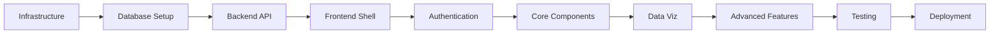

# 📋 Step-by-Step Implementation Plan (SOP)
## Retail Analytics Dashboard - Sequential Implementation Guide

**Total Duration**: 16 weeks  
**Team Size**: 4-6 developers  
**Approach**: Incremental delivery with 2-week sprints

---

## 🎯 Pre-Implementation Phase (Week 0)

### Day 1-3: Environment Setup & Access
```bash
# 1. Azure Account Setup
□ Create/verify Azure subscription
□ Set up Azure DevOps organization
□ Create resource groups:
  - rg-retail-analytics-dev
  - rg-retail-analytics-staging
  - rg-retail-analytics-prod

# 2. Development Environment
□ Install required tools:
  - Node.js 18.x
  - Azure CLI
  - Git
  - VS Code + extensions
  - Docker Desktop
  - Terraform

# 3. Repository Setup
git clone https://github.com/yourorg/retail-analytics-dashboard.git
cd retail-analytics-dashboard
npm install
```

### Day 4-5: Team Onboarding
```markdown
□ Conduct architecture walkthrough
□ Review existing database schema
□ Set up team permissions in Azure
□ Configure local development environments
□ Create team communication channels
```

---

## 📅 Week 1-2: Foundation & Infrastructure

### Step 1: Azure Infrastructure Setup (Days 1-3)

```bash
# 1.1 Create base infrastructure using Terraform
cd infrastructure/terraform
terraform init
terraform plan -var-file="environments/dev.tfvars"
terraform apply -var-file="environments/dev.tfvars"

# Resources created:
# - Azure SQL Database
# - Redis Cache
# - Storage Account
# - Application Insights
# - Key Vault
```

**Validation Checkpoint**:
```sql
-- Test Azure SQL connectivity
SELECT name FROM sys.databases;
SELECT * FROM INFORMATION_SCHEMA.TABLES WHERE TABLE_SCHEMA = 'dbo';
```

### Step 2: Database Setup (Days 4-5)

```sql
-- 2.1 Run existing schema verification
SELECT TABLE_NAME, COLUMN_NAME, DATA_TYPE 
FROM INFORMATION_SCHEMA.COLUMNS 
WHERE TABLE_SCHEMA = 'dbo'
ORDER BY TABLE_NAME;

-- 2.2 Create new aggregation tables
CREATE TABLE HourlyMetrics (
    MetricID INT IDENTITY(1,1) PRIMARY KEY,
    StoreID INT NOT NULL,
    MetricDate DATE NOT NULL,
    HourOfDay INT NOT NULL,
    TransactionCount INT,
    TotalRevenue DECIMAL(12,2),
    AvgTransactionValue DECIMAL(10,2),
    CONSTRAINT FK_HourlyMetrics_Store FOREIGN KEY (StoreID) 
        REFERENCES Stores(StoreID)
);

-- 2.3 Create indexes for performance
CREATE INDEX IX_SalesInteractions_Date_Store 
ON SalesInteractions(TransactionDate, StoreID);

CREATE INDEX IX_SalesInteractionBrands_Brand 
ON SalesInteractionBrands(BrandID) INCLUDE (Confidence);
```

### Step 3: Backend API Foundation (Days 6-10)

```bash
# 3.1 Initialize Azure Functions project
cd backend
func init --typescript
npm install

# 3.2 Create base function structure
mkdir -p functions/{GetMetrics,GetBrands,GetStores,shared}

# 3.3 Implement shared utilities
touch functions/shared/sqlClient.ts
touch functions/shared/auth.ts
touch functions/shared/cache.ts
```

**Implementation Order**:
1. SQL connection wrapper
2. Redis cache client
3. Authentication middleware
4. Error handling utilities
5. Logging configuration

**First API Endpoint** (GetStores):
```typescript
// functions/GetStores/index.ts
import { AzureFunction, Context, HttpRequest } from "@azure/functions";
import { getConnection } from "../shared/sqlClient";

const httpTrigger: AzureFunction = async function (
    context: Context,
    req: HttpRequest
): Promise<void> {
    try {
        const connection = await getConnection();
        const result = await connection.query`
            SELECT StoreID, StoreName, Location, DeviceID 
            FROM Stores 
            WHERE StoreID IS NOT NULL
        `;
        
        context.res = {
            body: { data: result.recordset }
        };
    } catch (error) {
        context.log.error('GetStores error:', error);
        context.res = {
            status: 500,
            body: { error: 'Internal server error' }
        };
    }
};

export default httpTrigger;
```

**Test the endpoint**:
```bash
# Local testing
npm run start
curl http://localhost:7071/api/stores

# Deploy to Azure
func azure functionapp publish <function-app-name>
```

---

## 📅 Week 3-4: Core Dashboard Development

### Step 4: React Application Setup (Days 1-2)

```bash
# 4.1 Initialize React app
cd frontend
npm create vite@latest . -- --template react-ts
npm install

# 4.2 Install core dependencies
npm install @mui/material @emotion/react @emotion/styled
npm install recharts d3 @types/d3
npm install @reduxjs/toolkit react-redux
npm install axios react-query
npm install react-router-dom

# 4.3 Set up folder structure
mkdir -p src/{components,pages,hooks,services,store,utils,types}
```

### Step 5: Authentication Implementation (Days 3-4)

```typescript
// 5.1 Azure AD B2C configuration
// src/services/auth.ts
import { PublicClientApplication } from '@azure/msal-browser';

const msalConfig = {
    auth: {
        clientId: process.env.REACT_APP_CLIENT_ID,
        authority: process.env.REACT_APP_AUTHORITY,
        redirectUri: window.location.origin
    }
};

export const msalInstance = new PublicClientApplication(msalConfig);

// 5.2 Auth provider component
// src/components/AuthProvider.tsx
export const AuthProvider: React.FC<{ children: ReactNode }> = ({ children }) => {
    return (
        <MsalProvider instance={msalInstance}>
            <MsalAuthenticationTemplate
                interactionType={InteractionType.Redirect}
                authenticationRequest={loginRequest}
            >
                {children}
            </MsalAuthenticationTemplate>
        </MsalProvider>
    );
};
```

### Step 6: Dashboard Layout & Navigation (Days 5-6)

**Implementation sequence**:
1. App shell with sidebar
2. Route configuration
3. Navigation menu
4. Responsive layout
5. Theme configuration

```typescript
// src/App.tsx
function App() {
    return (
        <AuthProvider>
            <ThemeProvider theme={theme}>
                <Router>
                    <DashboardLayout>
                        <Routes>
                            <Route path="/" element={<Overview />} />
                            <Route path="/brands" element={<BrandAnalytics />} />
                            <Route path="/stores" element={<StoreMetrics />} />
                            <Route path="/customers" element={<CustomerInsights />} />
                        </Routes>
                    </DashboardLayout>
                </Router>
            </ThemeProvider>
        </AuthProvider>
    );
}
```

### Step 7: KPI Cards Component (Days 7-8)

```typescript
// Implementation order:
// 1. Create KPICard component
// 2. Add loading states
// 3. Implement number animations
// 4. Add sparkline charts
// 5. Connect to API

// src/components/Dashboard/KPICards/index.tsx
export const KPICards: React.FC = () => {
    const { data, loading } = useMetricsSummary();
    
    const kpiData = [
        {
            title: 'Total Transactions',
            value: data?.totalTransactions || 0,
            change: data?.transactionChange || 0,
            icon: <TrendingUp />,
            color: 'primary'
        },
        // ... more KPIs
    ];
    
    return (
        <Grid container spacing={3}>
            {kpiData.map((kpi) => (
                <Grid item xs={12} sm={6} md={3} key={kpi.title}>
                    <KPICard {...kpi} loading={loading} />
                </Grid>
            ))}
        </Grid>
    );
};
```

---

## 📅 Week 5-6: Data Visualization Components

### Step 8: Time Series Charts (Days 1-3)

```typescript
// 8.1 Create base chart component
// src/components/Charts/TimeSeriesChart.tsx

// 8.2 Add interactivity
// - Zoom and pan
// - Tooltip customization
// - Export functionality

// 8.3 Connect to real data
const TimeSeriesContainer: React.FC = () => {
    const [dateRange, setDateRange] = useState(defaultDateRange);
    const { data, loading } = useTransactionTimeSeries(dateRange);
    
    return (
        <ChartCard title="Transaction Trends">
            <DateRangePicker value={dateRange} onChange={setDateRange} />
            <TimeSeriesChart 
                data={data} 
                loading={loading}
                height={400}
            />
        </ChartCard>
    );
};
```

### Step 9: Brand Performance Components (Days 4-6)

**Build sequence**:
1. Brand performance table with sorting
2. Category breakdown donut chart
3. Brand comparison bar chart
4. Confidence score visualization
5. Filter controls

### Step 10: API Integration Layer (Days 7-10)

```typescript
// 10.1 Create API client
// src/services/api.ts
class ApiClient {
    private baseURL: string;
    private axiosInstance: AxiosInstance;
    
    constructor() {
        this.baseURL = process.env.REACT_APP_API_URL || '';
        this.axiosInstance = axios.create({
            baseURL: this.baseURL,
            timeout: 10000
        });
        
        this.setupInterceptors();
    }
    
    // Add methods for each endpoint
    async getMetricsSummary(filters: FilterParams) {
        return this.axiosInstance.get('/metrics/summary', { params: filters });
    }
}

// 10.2 Create React Query hooks
export const useMetricsSummary = (filters: FilterParams) => {
    return useQuery(
        ['metrics-summary', filters],
        () => apiClient.getMetricsSummary(filters),
        {
            staleTime: 5 * 60 * 1000, // 5 minutes
            cacheTime: 10 * 60 * 1000
        }
    );
};
```

---

## 📅 Week 7-8: Advanced Analytics Features

### Step 11: Databricks ETL Pipeline (Days 1-4)

```python
# 11.1 Set up Databricks workspace
# 11.2 Create ETL notebooks in sequence:

# Notebook 1: Bronze to Silver Processing
def process_bronze_data():
    # Read bronze tables
    bronze_df = spark.read.table("bronze_transcriptions")
    
    # Clean and validate
    silver_df = bronze_df \
        .filter(col("TranscriptText").isNotNull()) \
        .withColumn("ProcessedDate", current_timestamp())
    
    # Write to silver layer
    silver_df.write.mode("append").saveAsTable("silver_transcriptions")

# Notebook 2: Session Matching
def match_sessions():
    transcripts = spark.read.table("silver_transcriptions")
    detections = spark.read.table("silver_detections")
    
    # Complex join logic for session correlation
    matched = transcripts.join(
        detections,
        (transcripts.DeviceID == detections.DeviceID) &
        (abs(transcripts.Timestamp - detections.Timestamp) < 300)
    )
    
    # Write matches
    matched.write.jdbc(url=jdbc_url, table="SessionMatches", mode="append")

# Notebook 3: Aggregation Jobs
def calculate_hourly_metrics():
    # Read from SQL
    interactions = spark.read.jdbc(url=jdbc_url, table="SalesInteractions")
    
    # Calculate metrics
    hourly = interactions \
        .groupBy(
            date_trunc("hour", col("TransactionDate")).alias("HourSlot"),
            "StoreID"
        ) \
        .agg(
            count("InteractionID").alias("TransactionCount"),
            avg("Age").alias("AvgAge"),
            countDistinct("FacialID").alias("UniqueCustomers")
        )
    
    # Write back to SQL
    hourly.write.jdbc(url=jdbc_url, table="HourlyMetrics", mode="overwrite")
```

### Step 12: Real-time Features (Days 5-8)

```typescript
// 12.1 WebSocket connection for live updates
// src/hooks/useRealtimeData.ts
export const useRealtimeData = (storeId?: number) => {
    const [data, setData] = useState<RealtimeTransaction[]>([]);
    
    useEffect(() => {
        const ws = new WebSocket(process.env.REACT_APP_WS_URL!);
        
        ws.onmessage = (event) => {
            const transaction = JSON.parse(event.data);
            if (!storeId || transaction.storeId === storeId) {
                setData(prev => [transaction, ...prev].slice(0, 50));
            }
        };
        
        return () => ws.close();
    }, [storeId]);
    
    return data;
};

// 12.2 Live transaction feed component
const LiveTransactionFeed: React.FC = () => {
    const transactions = useRealtimeData();
    
    return (
        <Card>
            <CardHeader title="Live Transactions" />
            <CardContent>
                <TransitionGroup>
                    {transactions.map(tx => (
                        <CSSTransition key={tx.id} timeout={500}>
                            <TransactionItem transaction={tx} />
                        </CSSTransition>
                    ))}
                </TransitionGroup>
            </CardContent>
        </Card>
    );
};
```

---

## 📅 Week 9-10: Customer & Transcript Analytics

### Step 13: Customer Journey Visualization (Days 1-4)

```typescript
// 13.1 Customer profile component
// 13.2 Emotion tracking charts
// 13.3 Purchase history timeline
// 13.4 Facial recognition accuracy metrics

// Implementation priority:
// 1. Basic customer lookup by FacialID
// 2. Transaction history table
// 3. Emotion trend chart
// 4. Brand affinity analysis
// 5. Predictive metrics
```

### Step 14: Transcript Analysis Dashboard (Days 5-8)

```typescript
// 14.1 Sentiment analysis visualization
// 14.2 Word cloud generation
// 14.3 Conversation topics
// 14.4 Request method analysis

const TranscriptAnalytics: React.FC = () => {
    const { transcripts, sentiment } = useTranscriptData();
    
    return (
        <Grid container spacing={3}>
            <Grid item xs={12} md={6}>
                <SentimentTrendChart data={sentiment} />
            </Grid>
            <Grid item xs={12} md={6}>
                <WordCloud words={extractKeywords(transcripts)} />
            </Grid>
            <Grid item xs={12}>
                <TranscriptTable 
                    data={transcripts}
                    onSelect={handleTranscriptSelect}
                />
            </Grid>
        </Grid>
    );
};
```

---

## 📅 Week 11-12: AI & Advanced Features

### Step 15: AI Recommendations Engine (Days 1-5)

```python
# 15.1 Train recommendation model
from mlflow.tracking import MlflowClient
from sklearn.ensemble import RandomForestClassifier

def train_product_recommendation_model():
    # Load training data
    training_data = load_transaction_history()
    
    # Feature engineering
    features = create_customer_features(training_data)
    
    # Train model
    model = RandomForestClassifier(n_estimators=100)
    model.fit(features, labels)
    
    # Log model to MLflow
    mlflow.sklearn.log_model(model, "product_recommender")
    
    # Deploy to Azure ML
    deploy_model_to_azure()

# 15.2 Create recommendation API endpoint
@app.route('/api/recommendations/<customer_id>')
def get_recommendations(customer_id):
    # Load customer profile
    profile = get_customer_profile(customer_id)
    
    # Get predictions
    recommendations = model.predict(profile)
    
    return jsonify({
        'customerId': customer_id,
        'recommendations': recommendations,
        'confidence': confidence_scores
    })
```

### Step 16: Export & Reporting Features (Days 6-8)

```typescript
// 16.1 PDF generation
// 16.2 Excel export with formatting
// 16.3 Scheduled reports
// 16.4 Email integration

const ExportService = {
    async generatePDF(dashboardData: DashboardData): Promise<Blob> {
        const doc = new jsPDF();
        
        // Add charts as images
        const charts = await captureCharts();
        charts.forEach((chart, index) => {
            doc.addImage(chart, 'PNG', 10, 10 + (index * 80), 190, 70);
        });
        
        // Add data tables
        doc.autoTable({
            head: [['Metric', 'Value', 'Change']],
            body: formatMetricsForPDF(dashboardData)
        });
        
        return doc.output('blob');
    }
};
```

---

## 📅 Week 13-14: Testing & Optimization

### Step 17: Comprehensive Testing (Days 1-5)

```bash
# 17.1 Unit test implementation order:
# - Utility functions
# - API clients
# - React hooks
# - Components
# - Redux reducers

# 17.2 Integration tests:
npm run test:integration

# 17.3 E2E test scenarios:
# - User login flow
# - Dashboard data loading
# - Filter interactions
# - Export functionality
# - Real-time updates

# 17.4 Load testing
k6 run tests/load/dashboard-load.js
```

### Step 18: Performance Optimization (Days 6-8)

```typescript
// 18.1 Implement lazy loading
const BrandAnalytics = lazy(() => import('./pages/BrandAnalytics'));

// 18.2 Optimize queries
-- Add missing indexes
CREATE INDEX IX_Transactions_DateRange 
ON SalesInteractions(TransactionDate) 
INCLUDE (StoreID, FacialID);

// 18.3 Implement caching strategy
const cacheMiddleware = (req, res, next) => {
    const key = `cache:${req.url}`;
    const cached = await redis.get(key);
    
    if (cached) {
        return res.json(JSON.parse(cached));
    }
    
    // Store original send
    const originalSend = res.json;
    res.json = function(data) {
        redis.setex(key, 300, JSON.stringify(data));
        originalSend.call(this, data);
    };
    
    next();
};
```

---

## 📅 Week 15-16: Deployment & Launch

### Step 19: Staging Deployment (Days 1-3)

```bash
# 19.1 Deploy infrastructure
cd infrastructure/terraform
terraform apply -var-file="environments/staging.tfvars"

# 19.2 Deploy backend
func azure functionapp publish retail-analytics-staging

# 19.3 Deploy frontend
npm run build
az staticwebapp deploy \
  --app-name retail-analytics-staging \
  --resource-group rg-retail-analytics-staging \
  --source ./dist

# 19.4 Run smoke tests
npm run test:smoke -- --env=staging
```

### Step 20: Production Deployment (Days 4-5)

```bash
# 20.1 Final security scan
npm audit fix
snyk test

# 20.2 Production deployment checklist
□ Database backups completed
□ Rollback plan documented
□ Monitoring alerts configured
□ Load balancer health checks passing
□ SSL certificates valid

# 20.3 Deploy to production
./scripts/deploy-production.sh

# 20.4 Post-deployment validation
npm run test:production-smoke
```

### Step 21: Documentation & Handover (Days 6-8)

```markdown
# 21.1 Complete documentation
□ API documentation with Swagger
□ User manual with screenshots
□ Admin guide
□ Troubleshooting guide
□ Architecture decisions record (ADR)

# 21.2 Knowledge transfer sessions
□ Developer walkthrough
□ Operations training
□ Business user training
□ Support team enablement

# 21.3 Set up monitoring dashboards
□ Application Insights dashboards
□ Custom alerts configuration
□ Performance baselines
□ SLA monitoring
```

---

## 🚨 Critical Path & Dependencies



## ⚠️ Risk Mitigation Checkpoints

### Week 2: Foundation Validation
- [ ] Azure resources accessible
- [ ] Database queries performing well
- [ ] API endpoints responding

### Week 4: Integration Checkpoint
- [ ] Frontend connects to API
- [ ] Authentication working
- [ ] Data flowing correctly

### Week 8: Feature Complete
- [ ] All core features implemented
- [ ] Performance benchmarks met
- [ ] Security scan passed

### Week 12: Quality Gate
- [ ] 80% test coverage achieved
- [ ] No critical bugs
- [ ] Performance SLAs met

### Week 16: Go-Live Readiness
- [ ] Production environment stable
- [ ] Monitoring in place
- [ ] Team trained

## 📊 Success Metrics

| Milestone | Target | Measurement |
|-----------|--------|-------------|
| API Response Time | < 200ms p95 | Application Insights |
| Dashboard Load Time | < 2 seconds | Lighthouse Score |
| Test Coverage | > 80% | Jest/Coverage Report |
| Deployment Success | 100% | CI/CD Pipeline |
| User Adoption | 50% in Month 1 | Usage Analytics |

---

## 🎯 Next Steps After Launch

1. **Week 17-18**: Bug fixes and stabilization
2. **Week 19-20**: Performance tuning based on real usage
3. **Month 2**: Feature enhancements based on feedback
4. **Month 3**: Scale optimization and cost review

This SOP provides the exact sequence and dependencies for implementing each component successfully.